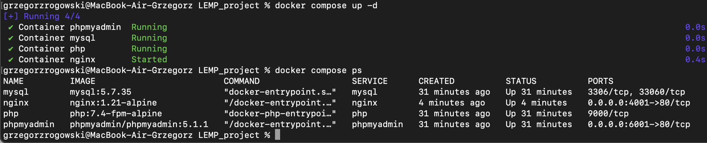
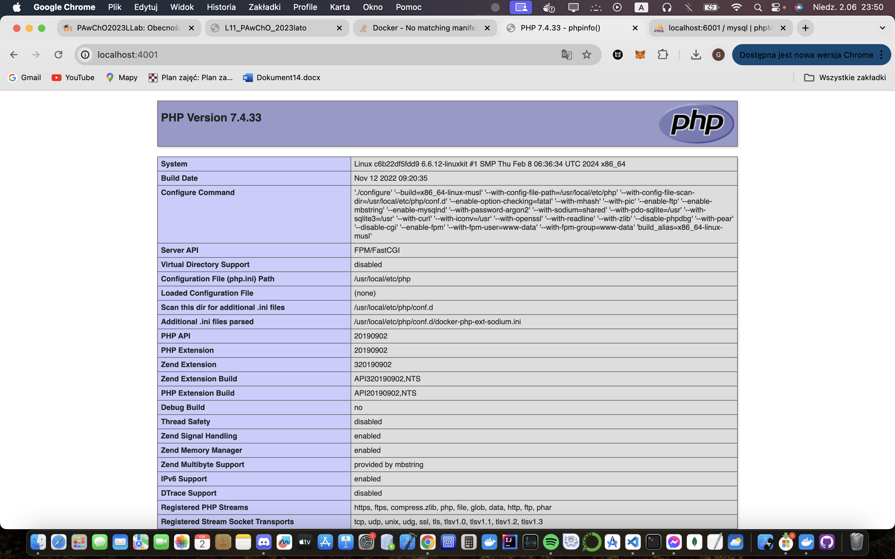

### Uruchomienie projektu i wyswietlenie dzialajacych kontenerow
1. 'docker compose up -d'
2. 'docker compose ps' 

   

### Sprawdzenie działania serwera Nginx
1. Przeglądarka internetowa: Wejdź na 'http://localhost:4001'

   Wynik: Wyświetla stronę startową PHP (phpinfo).
    

### Logowanie do phpMyAdmin
1. Przeglądarka internetowa: 'http://localhost:6001'

   Wynik: Można się zalogować do phpMyAdmin i utworzyć testową bazę danych.
   |

### Tworzenie testowej bazy danych
1. Zalogowanie sie do phpmyadmin
2. Utworzenie nowej bazy danych o nazwie 'testdb'.

   Wynik: Baza danych 'testdb' została pomyślnie utworzona.
   
